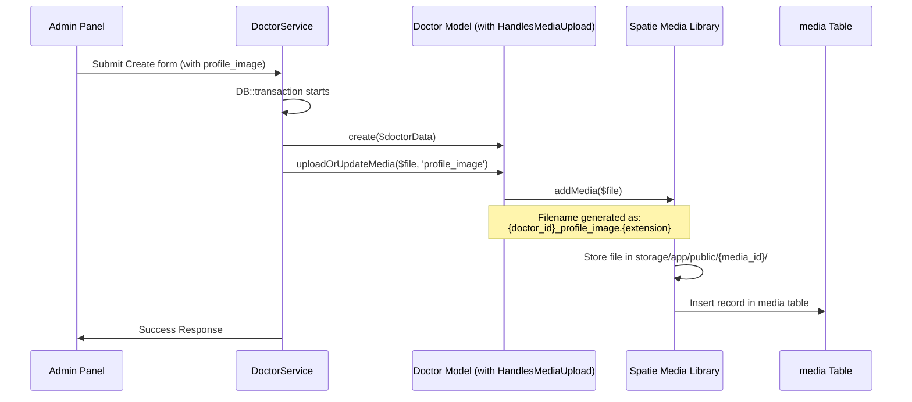
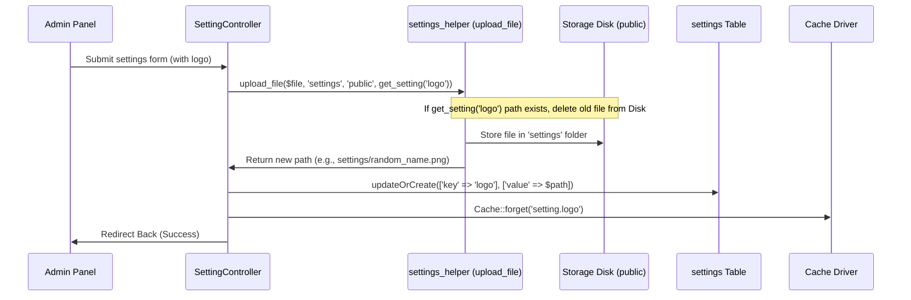

# Image Upload, Store, and Update System Flow

This document provides a detailed explanation of how images and media files are uploaded, stored, updated, and retrieved in the DocNest project. The system utilizes two distinct mechanisms based on the type of data being handled:

1. **Model Media Flow**: Used for specific Eloquent models (e.g., Doctor Profile Photos) using the Spatie Media Library package and a custom trait.
2. **App Settings Flow**: Used for application-wide settings (e.g., logos, favicons) using Laravel's native storage filesystem and a custom helper.

---

## 1. Model Media Flow (Spatie Media Library)

This flow is implemented using Spatie's `Laravel-Medialibrary` package combined with a custom Laravel Trait: `App\Traits\HandlesMediaUpload`. It is used on models like `App\Models\Doctor`.

### Key Components
- **Trait**: [`HandlesMediaUpload.php`](app/Traits/HandlesMediaUpload.php)
- **Model**: [`Doctor.php`](app/Models/Doctor.php)
- **Service**: [`DoctorService.php`](app/Services/DoctorService.php)

---

### A. Store Flow (Create Model)

When a new Doctor is created via the admin dashboard, the file upload is processed as follows:



#### Code Implementation (Store)
In `DoctorService.php`:
```php
$doctor = $this->repository->create($doctorData);

// Handle Profile Image upload
if (isset($data['profile_image'])) {
    $doctor->uploadOrUpdateMedia($data['profile_image'], 'profile_image');
}
```

In `HandlesMediaUpload.php`:
```php
public function uploadOrUpdateMedia(UploadedFile $file, string $collection = 'profile_image', bool $isUpdate = false): void
{
    if ($isUpdate) {
        $this->clearMediaCollection($collection);
    }

    $extension = $file->getClientOriginalExtension();
    $fileName = $this->id . '_' . $collection . '.' . $extension;

    $this->addMedia($file)
         ->usingFileName($fileName)
         ->toMediaCollection($collection);
}
```

---

### B. Update Flow (Edit Model)

When updating a doctor's profile picture, the old media must be removed from physical storage and the database before uploading the new one:

1. The `DoctorService->updateDoctor()` method calls `uploadOrUpdateMedia()` with the third argument (`$isUpdate`) set to `true`:
   ```php
   $doctor->uploadOrUpdateMedia($data['profile_image'], 'profile_image', true);
   ```
2. Because `$isUpdate` is `true`, it invokes Spatie's `clearMediaCollection($collection)`:
   - This deletes all file assets under that collection path (e.g., `storage/app/public/{old_media_id}/*`).
   - It deletes the corresponding rows in the `media` table.
3. The new file is saved and registered with a new `media` ID.

---

### C. Display & Fallback Mechanism

Rather than accessing raw paths, media is retrieved via the Spatie library API. `Doctor.php` overrides the default `getFirstMediaUrl()` method to verify physical file existence and handle default fallbacks:

```php
public function getFirstMediaUrl(string $collectionName = 'default', string $conversionName = ''): string
{
    $media = $this->getFirstMedia($collectionName);
    
    // Check if media exists in DB AND the file actually exists on the physical storage drive
    if ($media && file_exists($media->getPath($conversionName))) {
        return $media->getUrl($conversionName);
    }
    
    // If requesting profile photo and it is missing, return a default avatar asset
    if ($collectionName === 'profile_image') {
        return asset('assets/images/default-doctor.png');
    }
    
    return $media ? $media->getUrl($conversionName) : ($this->getFallbackMediaUrl($collectionName, $conversionName) ?: '');
}
```

---

## 2. App Settings Flow (Custom Helper File Storage)

This flow is used for generic configuration settings such as logos and favicons. It does not use Eloquent models directly to track files but instead saves the stored path as a string configuration value in the `settings` database table.

### Key Components
- **Helper**: [`settings_helper.php`](app/Helpers/settings_helper.php)
- **Controller**: [`SettingController.php`](app/Http/Controllers/Admin/SettingController.php)

---

### A. Store & Update Flow



#### Code Implementation (Helper)
In `settings_helper.php`:
```php
function upload_file(UploadedFile $file, string $folder = 'settings', string $disk = 'public', ?string $oldPath = null): string
{
    // Clean up old files on update to prevent disk bloating
    if ($oldPath && Storage::disk($disk)->exists($oldPath)) {
        Storage::disk($disk)->delete($oldPath);
    }

    return $file->store($folder, $disk);
}
```

In `SettingController.php`:
```php
if ($request->hasFile('logo')) {
    // 1. Upload new file and clean up old one using get_setting('logo')
    $path = upload_file($request->file('logo'), 'settings', 'public', get_setting('logo'));
    
    // 2. Save settings path in database
    Setting::updateOrCreate(['key' => 'logo'], ['value' => $path]);
    
    // 3. Invalidate settings cache
    Cache::forget("setting.logo");
}
```

---

### B. Display Mechanism

Settings paths are fetched using the `get_setting()` helper (which caches values forever to prevent database spamming) and wrapped inside Laravel's `asset('storage/' . $path)` helper:

```html
@if(get_setting('logo'))
    
@else
    <!-- Fallback Brand Div/SVG -->
@endif
```

---

## Comparison Summary

| Feature | Model Media Flow (e.g., Doctor Profile) | App Settings Flow (e.g., Logo/Favicon) |
| :--- | :--- | :--- |
| **Package/Tech** | Spatie Media Library | Laravel Storage Facade |
| **Database Storage** | `media` polymorphic table | `settings` table (as plain text paths) |
| **Physical Path** | `storage/app/public/{media_id}/{filename}` | `storage/app/public/{folder}/{random_filename}` |
| **Update Deletion** | Automatic via Spatie `clearMediaCollection` | Manual check & delete via `Storage::disk()->delete()` |
| **Caching** | Standard DB queries / relationships | Forever cache invalidation on key update |
| **Fallback Image** | Returns default avatar asset path | Handled with HTML condition logic in Blade views |
